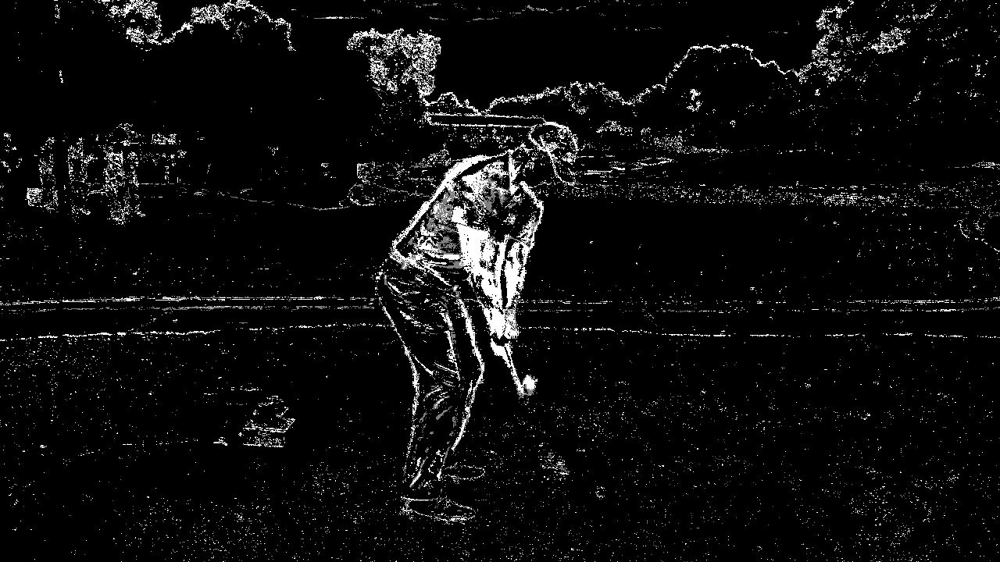

# MotionSense
MotionSense is a work in progress software tool designed to capture, analyze, and visualize complex movements with precision and ease. 

# Working note:

## Skeleton 
- links:
    - https://github.com/LiiNen/CV_skeleton_provider

### Background removal

- Provides a less cluttered image for creating skeleton
- uses samplecode now..
- links:
    - https://www.instrument.com/latest/body-detection-with-computer-vision
    - https://docs.opencv.org/4.x/d1/dc5/tutorial_background_subtraction.html

